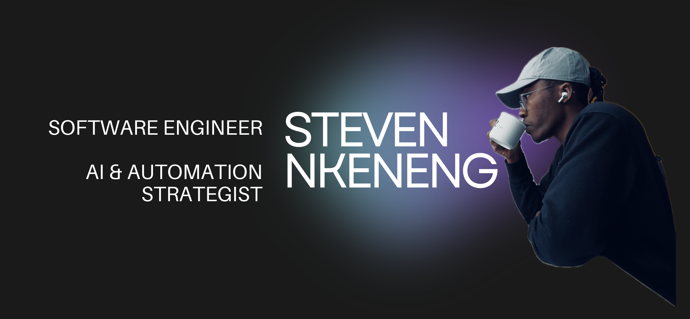

<h1>

</h1>

    <h2>🚀 About Me</h2>
    
I'm a Software Engineer specializing in AI-driven automation, E-Commerce platforms (Shopware 6), and high-performance web solutions. Passionate about integrating cutting-edge technologies to optimize business efficiency, reduce costs, and enhance user experience. Experienced in leading cross-functional teams, mentoring junior developers, and driving digital transformation in competitive markets.

    <h2>🚀 Connect with Me</h2>
    
     

    <h2>🚀 Programming languages</h2>
        
          
               
                 

    <h2>🚀 Frameworks and Platforms</h2>
        
          
               
                 
        

    <h2>🚀 Tools I use</h2>
        
          
               
                 
                     
                       
                        
                                 

    <h2>🚀 Github Stats</h2>
    

    

        
        
    

    

